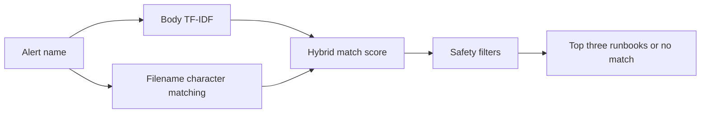

# Runbook Radar


Runbook Radar helps L1 operations teams find the most relevant troubleshooting
guide for an alert.

## Problem

Operational runbooks are stored in Git repositories, but monitors do not always
contain direct links to them. Engineers may spend valuable time searching for a
guide or may select an incorrect runbook with similar terminology.

## V1 scope

Given an alert name, Runbook Radar searches a local collection of Markdown
runbooks and returns up to three relevant matches.

It runs locally and does not send runbook contents or alert names to an external
API.

## How it works



Runbook Radar combines:

- Word-level TF-IDF similarity for runbook contents
- Character n-gram similarity for runbook filenames
- Distinctive-term checks to reject generic symptom-only matches
- A minimum match threshold
- A requirement for multiple distinctive filename terms before filename
  similarity can influence ranking

Match scores are ranking signals, not probabilities.

## Installation

```bash
python3 -m venv .venv
source .venv/bin/activate
python -m pip install -r requirements.txt
```

## Usage

Search the bundled synthetic runbooks:

```bash
python search.py
```

Search an external local runbook directory:

```bash
RUNBOOK_RADAR_RUNBOOKS_DIR="/absolute/path/to/runbooks" \
python search.py
```

External runbooks remain in their original directory and are not copied into
this repository.

## Evaluation

Run the synthetic evaluation suite:

```bash
python evaluate.py
```

Current development result:

```text
Evaluation cases: 14
Top-1 accuracy: 100.0%
Top-3 accuracy: 100.0%
```

These results apply only to the bundled synthetic cases. They do not establish
accuracy on a production runbook collection.

## Safety boundary

Runbook Radar recommends possible guides. It does not execute remediation
steps, modify infrastructure, or replace engineer review.

When no candidate passes the safety checks, it returns:

```text
No reliable runbook match found.
```

## Limitations

- V1 uses only the alert name.
- Runbook repositories may use inconsistent terminology.
- Similar symptoms can occur across unrelated services.
- Thresholds and heuristics were developed using a small synthetic dataset.
- Real-world performance requires evaluation with sanitized representative
  alerts.
- V1 does not synchronize with GitHub or a monitoring platform.

## Roadmap

- Expand the synthetic evaluation set
- Test with sanitized real-world alert/runbook pairs
- Improve result explanations
- Add automated tests
- Support direct runbook links
- Explore semantic embeddings in a later version